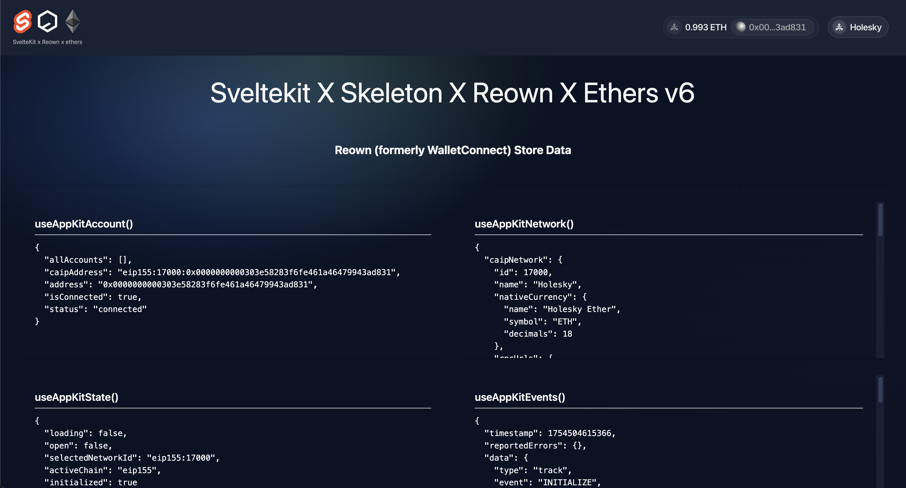

# Sveltekit-Reown-Ethers

[![Contributors][contributors-shield]][contributors-url]
[![Forks][forks-shield]][forks-url]
[![Stargazers][stars-shield]][stars-url]
[![Issues][issues-shield]][issues-url]
[![MIT License][license-shield]][license-url]

A more opinionated, but barebones front end Sveltekit web3 template using some of my favorite technologies, some might even say the best Sveltekit-web3 template.

sveltekit-reown-ethers is the lovechild of the ['create-skeleton-app'](https://www.skeleton.dev/docs/get-started/installation/sveltekit) command and the [demo example provided by Reown (formerly WalletConnect)](https://github.com/reown-com/appkit/tree/main/examples/sveltekit-wagmi).

   

If you fork this repo and like it, maybe give it a star so other Sveltekit devs can see it when they search 'web3 sveltekit'. If you have meaningful contributions to add, I am happy to merge them.

The main differences between this repo and [the older sveltekit repo I created](https://github.com/Elliott-Green/sveltekit-reown-ethers) are the following upgrades:

- Svelte v4 -> v5
- Skeleton v2 -> v3
- Tailwind v3 -> v4
- Wagmi v2 -> Ethers v6
- web3modal -> reown

I found when trying to build this with the reown wagmi example, the `writeContract` method would never find the correct provider, if this has been solved, then let me know and I will link your repo here.

## Contributions + to-do-list

- Mobile fixes to Nav & `./+page.svelte`
- SEO
- PWA
  
## Contact

Elliott Green - [@cryptonines](https://twitter.com/cryptonines)

Project Link: [https://github.com/Elliott-Green/sveltekit-reown-ethers](https://github.com/Elliott-Green/sveltekit-reown-ethers)

This repository superceeds my previous opensource Sveltekit web3 UI learning efforts [archived here](https://github.com/reown-com/appkit/tree/main/examples/sveltekit-wagmi) and [here](https://github.com/Elliott-Green/SveltekitXSkeletonXEthers).

(<a href="#readme-top">back to top</a>)

[contributors-shield]: https://img.shields.io/github/contributors/Elliott-Green/sveltekit-reown-ethers.svg?style=for-the-badge
[contributors-url]: https://github.com/Elliott-Green/sveltekit-reown-ethers/graphs/contributors
[forks-shield]: https://img.shields.io/github/forks/Elliott-Green/sveltekit-reown-ethers.svg?style=for-the-badge
[forks-url]: https://github.com/Elliott-Green/sveltekit-reown-ethers/network/members
[stars-shield]: https://img.shields.io/github/stars/Elliott-Green/sveltekit-reown-ethers.svg?style=for-the-badge
[stars-url]: https://github.com/Elliott-Green/sveltekit-reown-ethers/stargazers
[issues-shield]: https://img.shields.io/github/issues/Elliott-Green/sveltekit-reown-ethers.svg?style=for-the-badge
[issues-url]: https://github.com/Elliott-Green/sveltekit-reown-ethers/issues
[license-shield]: https://img.shields.io/github/license/Elliott-Green/sveltekit-reown-ethers.svg?style=for-the-badge
[license-url]: https://github.com/Elliott-Green/sveltekit-reown-ethers/blob/main/LICENCE
